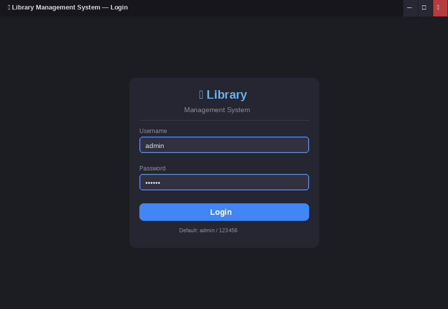
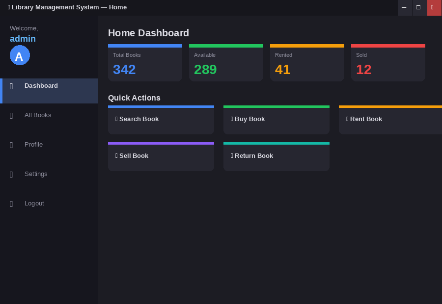
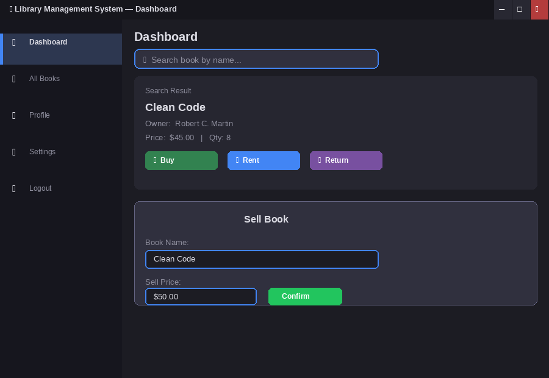
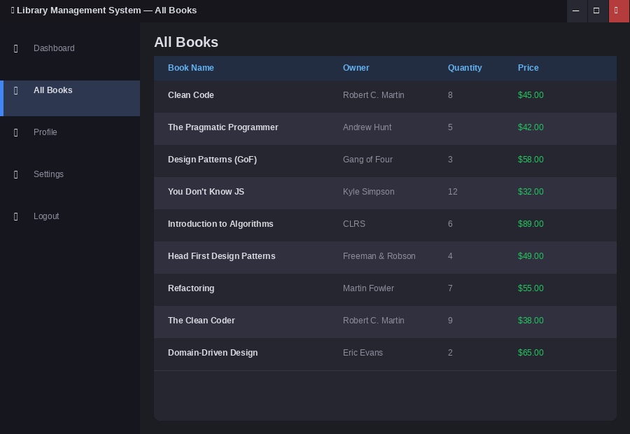

# Library Management System

[](https://www.java.com/)
[](https://openjfx.io/)
[](https://www.mysql.com/)
[](https://maven.apache.org/)
[](https://junit.org/junit5/)

JavaFX desktop application for managing a library catalogue — login, search, buy, rent, sell, and return books, backed by MySQL. Includes a dark mode toggle and JUnit 5 test suite.

## Screenshots

| Login | Home | Dashboard | All Books |
|---|---|---|---|
|  |  |  |  |

> Run with `mvn javafx:run` after setting up MySQL (see setup below).

## Tech Stack

| Layer | Technology |
|---|---|
| Language | Java 17 |
| UI Framework | JavaFX 21 |
| Database | MySQL / MariaDB |
| DB Driver | MySQL Connector/J 9.x |
| Build Tool | Apache Maven |
| Tests | JUnit 5 |

## Screens

| Scene | Description |
|---|---|
| Login | Username + password validated against `user` table |
| Home | Navigation hub — buttons to all screens + logout |
| Dashboard | Search, Buy, Rent, Sell (dialog), Return — all updating the DB |
| All Books | TableView: name, owner, quantity, price from `book` table |
| Profile | Current user info (username, role, member since) |
| Settings | Toggle light / dark theme |

## Database Schema

```sql
CREATE TABLE user (
    username VARCHAR(50)  PRIMARY KEY,
    password VARCHAR(100) NOT NULL
);

CREATE TABLE book (
    id       INT AUTO_INCREMENT PRIMARY KEY,
    bookname VARCHAR(150) NOT NULL,
    price    DOUBLE       NOT NULL,
    quantity INT          NOT NULL,
    owner    VARCHAR(100) NOT NULL
);
```

## Project Structure

```
library-app/
├── pom.xml
├── sql/library.sql                  DB schema + seed data
├── docs/class-diagram.png           UML class diagram
└── src/
    ├── main/java/library/
    │   ├── LibraryApplication.java  JavaFX app + all scenes
    │   ├── Book.java                Model (JavaBean for TableView)
    │   └── DatabaseManager.java     MySQL CRUD operations
    └── test/java/library/
        └── LibraryAppTest.java      JUnit 5 unit tests
```

## How to Run

**Prerequisites:** Java 17+ · Maven 3.8+ · MySQL on port 3306

```bash
# 1. Create the database
mysql -u root -p < sql/library.sql

# 2. Run the app
mvn javafx:run

# 3. Run tests
mvn test
```

**Default credentials:** `admin / 123456` · `staff / 123456` · `member / 123456`

> To use different DB credentials, edit `DB_URL`, `DB_USER`, `DB_PASS` in `DatabaseManager.java`.

## License

[MIT](LICENSE)
